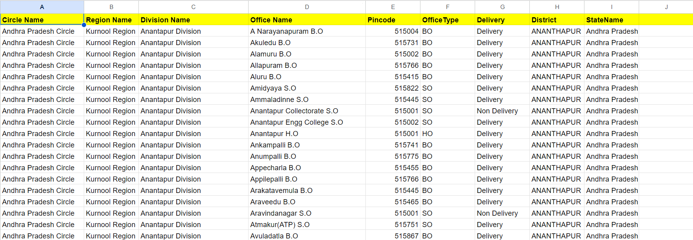
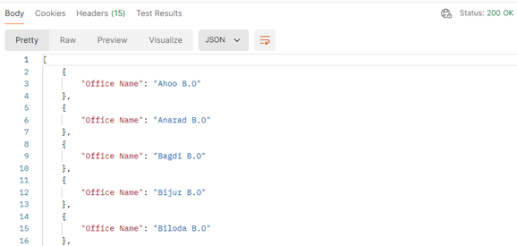
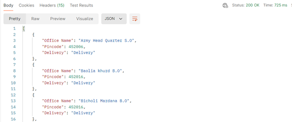
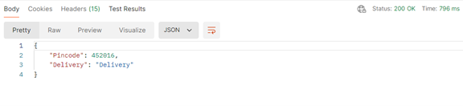
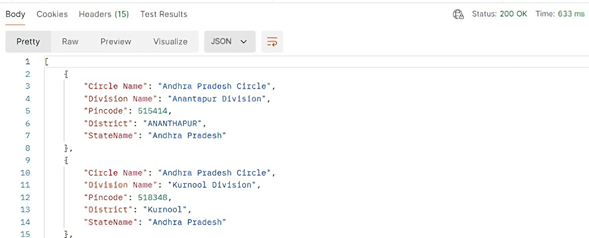

# PinCode-API-Project
# Google Sheets API Backend with Apps Script
This project is a custom API built on Google Apps Script to retrieve data on Google Sheets in real time. It enables users to automate Google Sheets workflows, fetch data, and integrate with third-party applications seamlessly. 
 
 
The PIN Code API provides functionalities related to PIN codes, initially developed using Google Apps Script and Google Sheets. Originally part of a bigger project, the API was created to handle large datasets efficiently.   
The API functionality was modified and now serves 3 purposes:
   
+ Search By Pincode
+ Search By District
+ Search By Office Name
  
**I have changed the last part (i.e., Search By Office Name), so it is not functional.  
I present it to you for fixing the intentional bug and/or providing new functionality for the API. 
Feel free to integrate it into your projects. :)
 Do something creative! Good Luck!**
 
Detailed description of the working and type of response are provided below. 
  
NOTE: Method is GET for all scenarios
  
**cURL**  
--location 'https://script.google.com/macros/s/AKfycbznP4tVoAoSpaJ2XSR9u1wum3fZkUoLCvlYvIYTy6z-XIbyIDnjgh8NmsLCrvcSCFvN/exec?district=Indore'
  

Sample Sheet: 

**Scenario 1: Searching by Pincode**
URL: https://script.google.com/macros/s/AKfycbyQ8f_u4mx77onOKUv3HZIWXmzyjoqqmleKxSKoLnpOCRDpgd7eAnsF79ZNFhqrirQp/exec?pincode=123456
  **Response:**
+	If no rows contains the pincode, it returns an error message.
+	If a single row matches the pincode, it returns the entire row as a JSON object.(E.g. 452012) 

+	If multiple rows match the pincode, it returns an array of office names. (E.g. 454001)

**Scenario 2: Searching by District**
URL: https://script.google.com/macros/s/AKfycbznP4tVoAoSpaJ2XSR9u1wum3fZkUoLCvlYvIYTy6z-XIbyIDnjgh8NmsLCrvcSCFvN/exec?district=exampleDistrict
  **Response:**
+	If no rows match the district, it returns an error message.
+	If rows match the district, it returns an array of objects with "Office Name", "Pincode", and "Delivery" values.

**Scenario 3: Searching by Office Name**
URL: https://script.google.com/macros/s/AKfycbyQ8f_u4mx77onOKUv3HZIWXmzyjoqqmleKxSKoLnpOCRDpgd7eAnsF79ZNFhqrirQp/exec?=exampleOfficeName
  **Response:**
+	If no rows match the office name, it returns an error message.
+	If a single row matches the office name, it returns the "Pincode" and "Delivery" values. 

 
+	If multiple rows match the office name, it returns an array of objects with "Circle Name", "Division Name", "Pincode", "District", and "StateName" values. 
<!---  --->
  
**Contributing** 
We welcome contributions! Please follow these steps:
 
1. Fork the repository. 
2. Create a new branch (git checkout -b feature-branch). 
3. Make your changes. 
4. Commit your changes (git commit -m 'Add new feature'). 
5. Push to the branch (git push origin feature-branch). 
6. Create a new Pull Request. 
  

In the future, I plan to re-implement this API using SpringBoot and AWS to enhance performance and scalability, as well as to explore database indexing in AWS for optimal performance.
  

**Contact** 
For any inquiries or feedback, please contact suyashbaoney58@gmail.com. 
 
 
