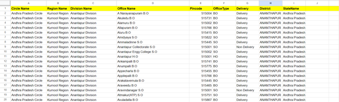
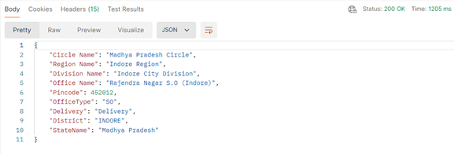

# PinCode-API-Project
# Google Sheets API Backend with Apps Script
This project is a custom API built on Google Apps Script to retrieve data on Google Sheets in real time. It enables users to automate Google Sheets workflows, fetch data, and integrate with third-party applications seamlessly. 
 
 
The PIN Code API provides functionalities related to PIN codes, initially developed using Google Apps Script and Google Sheets. Originally part of a chatbot integration project, the API was created to handle large datasets efficiently. 
  
NOTE: Method is GET for all scenarios
  
**cURL**
curl --location 'https://script.google.com/macros/s/AKfycbzs_5sOiH_PQQR7wnwBxwewPu4DvXygom3FHIIgBQ_U70OwmLzpJrBgVzEUy6plTg9O/exec?district=indore' \
--data ''

**Scenario 1: Searching by Pincode**
URL: https://script.google.com/macros/s/AKfycbzs_5sOiH_PQQR7wnwBxwewPu4DvXygom3FHIIgBQ_U70OwmLzpJrBgVzEUy6plTg9O/exec?pincode=123456
  **Response:**
+	If no rows contains the pincode, it returns an error message.
+	If a single row matches the pincode, it returns the entire row as a JSON object.(E.g. 452012) 
 
+	If multiple rows match the pincode, it returns an array of office names. (E.g. 454001)

**Scenario 2: Searching by District**
URL: https://script.google.com/macros/s/AKfycbzs_5sOiH_PQQR7wnwBxwewPu4DvXygom3FHIIgBQ_U70OwmLzpJrBgVzEUy6plTg9O/exec?district=exampleDistrict
  **Response:**
+	If no rows match the district, it returns an error message.
+	If rows match the district, it returns an array of objects with "Office Name", "Pincode", and "Delivery" values.

**Scenario 3: Searching by Office Name**
URL: https://script.google.com/macros/s/AKfycbzs_5sOiH_PQQR7wnwBxwewPu4DvXygom3FHIIgBQ_U70OwmLzpJrBgVzEUy6plTg9O/exec?officeName=exampleOfficeName
  **Response:**
+	If no rows match the office name, it returns an error message.
+	If a single row matches the office name, it returns the "Pincode" and "Delivery" values. 

 
+	If multiple rows match the office name, it returns an array of objects with "Circle Name", "Division Name", "Pincode", "District", and "StateName" values.
  
  

In the future, I plan to re-implement this API using SpringBoot and AWS to enhance performance and scalability, as well as to explore database indexing in AWS for optimal performance.
  
Using AWS Cloud over Google Sheets offers several advantages, especially for businesses and developers looking for more robust and scalable solutions. Here are some key benefits:
  
1. **Scalability**: AWS provides highly scalable infrastructure, allowing you to handle large amounts of data and traffic seamlessly. Google Sheets, on the other hand, is limited in terms of the amount of data it can handle efficiently.
  
2. **Security**: AWS offers advanced security features, including encryption, identity and access management (IAM), and compliance with numerous global standards¹. Google Sheets has basic security features but lacks the comprehensive security measures provided by AWS.
  
3. **Performance**: AWS services like EC2, S3, and RDS are designed for high performance and reliability, making them suitable for mission-critical applications¹. Google Sheets is more suited for lightweight tasks and may not perform well under heavy loads.
  
4. **Flexibility**: AWS supports a wide range of services and integrations, including machine learning, data analytics, and IoT¹. This flexibility allows you to build complex applications and workflows that are not possible with Google Sheets.
  
5. **Global Reach**: AWS has a vast global infrastructure with numerous data centers around the world, ensuring low latency and high availability¹. Google Sheets, being a web-based application, does not offer the same level of global infrastructure support.
  
(1) <a href = "https://www.cloudwards.net/google-cloud-vs-aws/">Google Cloud vs AWS: Which Cloud Computing Platform is Better? </a>- Cloudwards. 
(2) <a href = "https://www.gartner.com/reviews/market/strategic-cloud-platform-services/compare/amazon-web-services-vs-google">Amazon Web Services (AWS) vs Google - Gartner. </a> 
(3) <a href = "https://www.techquintal.com/advantages-and-disadvantages-of-aws/">8 Advantages and Disadvantages of AWS (Amazon Web Services). </a> 
(4) <a href = "https://cloudvisor.co/aws-guides/aws-vs-google-cloud-comparison/">A Comprehensive Comparison: AWS vs Google Cloud - Cloudvisor. </a> 
(5) <a href = "https://www.techrepublic.com/article/aws-vs-google-cloud/">Google Cloud vs. AWS Comparison: Which Is Best? - TechRepublic. </a> 

